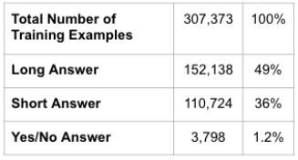

# Google Natural Questions: Question-Answering System
### John Bica | Geoff Korb | Hannah Stoik

## Summary

An open-domain question answering (QA) system takes a natural language questions, such as “Who is the lead singer of Vampire Weekend?”, rather than a set of keywords, such as “Vampire Weekend lead singer”. The returned answer is in the form of short texts, such as “Ezra Koenig”, rather than as a list of relevant documents, like a classic web browser provides. Improved question answering systems will make the search for answers faster and more accurate, which can have a multitude of benefits, from the student who can find information more quickly, to the inexperienced user who can find information at all. To help spur research advances in QA, Google built Natural Questions (NQ) [1], a new, large-scale corpus for training and evaluating open-domain question answering systems, and the first to replicate the end-to-end process in which people find answers to questions. Our intent is to build a system and submit it for evaluation.

The NQ corpus uses naturally occurring queries and focuses on finding answers by reading an entire page, rather than extracting answers from a short paragraph. It consists of real, anonymized, aggregated queries that users have posed to Google's search engine. Then, annotators were asked to find answers by reading through an entire Wikipedia page as they would if the question had been their own. They look for both long answers that cover all of the information required to infer the answer, and short answers that answer the question succinctly with the names of one or more entities. The quality of the annotations in the NQ corpus has been measured at 90% accuracy. The public release consists of 307,373 training examples with single annotations, 7,830 examples with 5-way annotations for development data, and a further 7,842 examples 5-way annotated sequestered as test data. 

The majority of successful submissions to the NQ challenge use some derivation of Google’s Bidirectional Encoder Representations from Transformers (BERT), and that was exactly the method the creators of the NQ corpus used. With a fairly simple model, they managed to reduce the gap between the model F1 scores reported in the original dataset paper and the human upper bound by 30% and 50% relative for the long and short answer tasks respectively. Our plan is to begin with that model as a baseline, and find ways to improve on it.

## Proposed Plan of Research
This project will occur throughout the course of the entire semester. It will be completed through two stages, with the first stage being completed by February 26 and the second stage being completed by April 8. 

### Stage One
The first task to complete will be a review and update of the provided code. Through the Google Natural Questions GitHub, code has been provided on how to get started with the dataset. 

The data is provided in a form where each training example containing four main items: question, corresponding Wikipedia page, long answer candidate(s), and annotation [3]. The annotation will include both the correct (or chosen) long answer as well as potential short answers (or NULL if not applicable). We will use the tokenized representation of the training examples which will allow for easy use of parsing

For pre-processing, we will attempt to optimize for our training model by first paring down our long answer candidates using TF-IDF (term frequency - inverse document frequency) which is information retrieval scoring measure that helps determine how relevant a term is in a given document. Once that is done, we can extract key dimensions in the data and feeding multiple training instances into BERT using a sliding window technique on the text as the BERT requires a specified maximum sequence length, meaning some texts might be too long to fit into one single training instance. 

We will build a BERT model as a baseline model for comparing other models to. This model is heavily studied in literature and has proven to be a good start towards building a comprehensive QA system [4]. Another model we plan to build is the DecAtt+DocReader model, which combines a decomposable attachment (DecAtt) model and document reader (DocReader) model towards finding the long answer and short answer, respectively [2, 3]. This model historically does not perform as well as the BERT model, but provides useful tools and understanding towards building an improved QA model. 

### Evaluation Metrics
We will be using precision, recall, and F1 score metrics to evaluate the models. The definition of these metrics is extensively described in current research [1]. They use how many annotators find a given set of sentences to be included in the long answer to determine whether a given answer found by the machine is correct or not. These metrics are also how the Google competition scores any submitted models. Furthermore, we will look to optimize our model and improve results by trying different hyper parameters for the sliding window technique responsible for the length of the training instances.

### Stage Two
By the end of the semester, we hope to build a model that exceeds the performance of the BERT model. We will also submit this model to the Google competition. We also hope to build a simple  web-app or user interface to post a query and select a Wikipedia page and respond with the corresponding long and short answer provided by the best performing model we develop.  

## Preliminary Results
The dataset includes 307,373 training examples, 7,830 development examples and 7,824 testing examples. Of the 307,373 training examples, not all of them include a long answer, an intentional aspect of the dataset meant to train models that can determine not only where the long answer is, but if a long exists at all. Table 1 shows the distribution of answers within the training dataset. 

*Table 1. Distribution of answers in training dataset.*

Each long answer is an HTML bounding box on the Wikipedia page corresponding to the given question. This long answer can be in a variety of HTML formats and the distribution is shown in Table 2. 

*Table 2. Distribution of long answers in HTML.*

## References
[1] Tom Kwiatkowski, Jennimaria Palomaki, Olivia Redfield, Michael Collins, et al. Natural Questions: A Benchmark for Question Answering Research. Transactions of the Association of Computational Linguistics. (2019)

[2] Danqi Chen, Adam Fisch, Jason Weston & Antoine Bordes. Reading Wikipedia to Answer Open-Domain Questions. arXiv:1704.00051v2 [cs.CL] (2017)

[3] Yiling Chen and Rena Sha. Question Answering on Natural Questions. (2019)

[4] Chris Alberti, Kenton Lee, and Michael Collins. 2019. A BERT Baseline for Natural Questions. arXiv preprint:1901.08634

