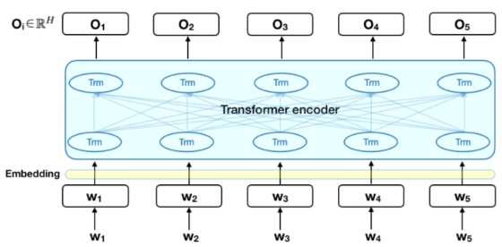
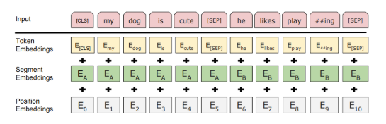
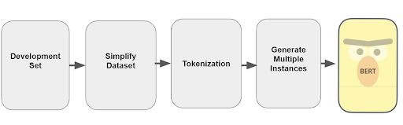
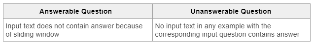
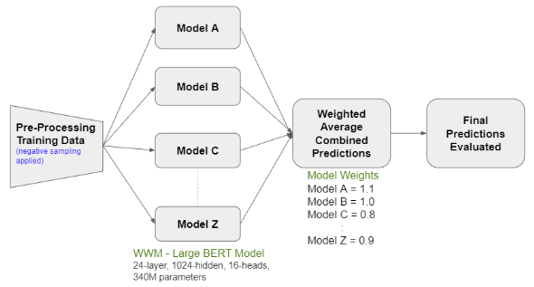
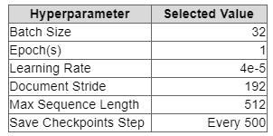
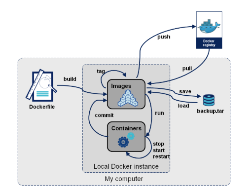
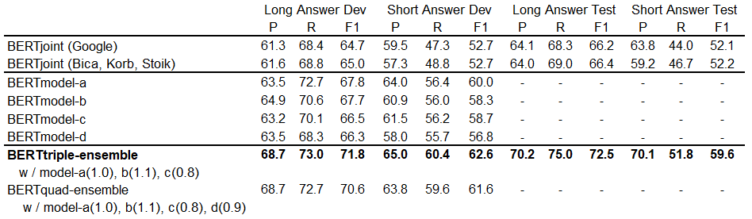

# Google Natural Questions: Question-Answering System
### John Bica | Geoff Korb | Hannah Stoik

## Summary
An open-domain question answering (QA) system takes natural language questions, such as “Who is the lead singer of Vampire Weekend?”, rather than a set of keywords, such as “Vampire Weekend lead singer”. The returned answer is in the form of short texts, such as	 “Ezra Koenig”, rather than as a list of relevant documents, like a classic web browser provides. Improved question answering systems will make the search for answers faster and more accurate, which can have a multitude of benefits, from the student who can find information more quickly, to the inexperienced user who can find information at all. To help spur research advances in QA, Google built Natural Questions (NQ) [1], a new, large-scale corpus for training and evaluating open-domain question answering systems, and the first to replicate the end-to-end process in which people find answers to questions.

### Dataset Overview
The NQ corpus uses naturally occurring queries and focuses on finding answers by reading an entire page, rather than extracting answers from a short paragraph. It consists of real, anonymized, aggregated queries that users have posed to Google's search engine. Then, annotators were asked to find answers by reading through an entire Wikipedia page as they would if the question had been their own. They look for both long answers that cover all of the information required to infer the answer, and short answers that answer the question succinctly with the names of one or more entities. The quality of the annotations in the NQ corpus has been measured at 90% accuracy. The public release consists of 307,373 training examples with single annotations, 7,830 examples with 5-way annotations for development data (Appendix C), and a further 7,842 examples 5-way annotated sequestered as test data. 

### Approach Overview
The majority of successful submissions to the NQ challenge use some derivation of Google’s Bidirectional Encoder Representations from Transformers (BERT)[4], and that was exactly the method the creators of the NQ Wikipedia corpus used. With a fairly simple model, they reduced the gap between the model F1 scores reported in the original dataset paper and the human upper bound by 30% and 50% relative to the long and short answer tasks respectively. We began with that model as a baseline, found ways to improve on it, and submitted the improved models for official evaluation by the Google Natural Questions challenge.

## Methods
### Defining the BERT Model Architecture
The BERT model is a multi-layer bidirectional Transformer encoder designed to be trained and used for a wide variety of NLP tasks throughout various disciplines. Its architecture can be seen in Figure 1, where *w1, w2, ..., w5* are vectorized input tokens and *O1, O2, ..., O5* are output predictions. 

*Figure 1. BERT Model Architecture.*

The input into the BERT model follows a word-piece tokenization, illustrated in Figure 2. A classifier token, [CLS], at the beginning of every input example to indicate the start of a new example and a separator token, [SEP], is added at the end of every sentence/segment within the input example. The token embeddings are gathered from a vast vocabulary file such that every token in the input corresponds to a token in the vocabulary file. The segment embeddings refer to whether the token belongs to the first sentence/segment or the second and the position embeddings refer to the token’s position within the input example.

*Figure 2. Word-piece tokenization.*

The Transformer encoder architecture includes layers of Transformers, which have a similar architecture to a traditional RNN or LSTM as they both contain an encoder-decoder structure. However, while a traditional RNN feeds the encoder an input sequence, waits for the decoder to produce an output sequence, and repeats, a Transformer is a parallelized version of this encoder-decoder structure. This, along with the unique attention functions used to produce the output, provide for a structure that has the capacity to learn complex linguistic characteristics and semantics [5,7,8]. In other words, this directly relates to the task at hand of searching and “predicting” answers to provided questions based on context in the text. 

### Data Preparation and Pre-Processing
For pre-processing both the training and development datasets, any unnecessary data not needed for inference such as HTML document text and urls for each example was initially removed. The cleaned dataset was then tokenized using the word piece tokenization package provided by the BERT model framework. Using the tokenized version of each example, all possible instances were generated using a slide token size window of 512 tokens with a stride of 128 tokens. As a reference, there were 30 instances generated per example on average during training of the model used [4]. The overall process is outlined in Figure 3 below.

*Figure 3. Pre-processing of a dataset*

 ### Negative Instance Sampling
A negative instance is defined as an instance where the input text does not contain the answer to the corresponding input question. Every input question in the training data is manually defined as either “answerable” or “unanswerable”, as described in Table 1. 

*Table 1. Defining Types of Questions*

To develop the input training dataset, instances defined as positive, where the input text does contain the answer to the corresponding input question, are sampled out of all generated instances. Negative instances are sampled at defined rates to ensure the model is trained and fine-tuned seeing both positive and negative instances. The negative instance sampling rate is defined for both answerable questions and unanswerable questions. These negative instances are sampled from instances that do not include an overlapping window with the positive instance of the corresponding input question. Changing the rate at which negative instances are sampled from both answerable and unanswerable questions can influence how confident a model is in finding an answer to an unanswerable question [6]. 

### Evaluation Metrics
#### Accuracy Scores
The results of the inference on the pre-trained model were evaluated using precision, recall, and F1 score metrics. Recall is the proportion of non-null answers that are correctly predicted. Precision is the proportion of predictions that are correct. The application of these metrics is extensively described in Google’s Natural Questions research [1], specifically the components used for precision and recall measures. Further, the highest weight and importance is given to the F1 score, which considers both precision and recall measures. F1 is defined as:

*F1=2 Precision * Recall / Precision + Recall.*    	            		

Given that the development test set is highly unbalanced in terms of both  null to non-null answer ratios and long to short answers, the F1 metric is the best measure to account for this inconsistency and the tradeoff that occurs.

#### Correctness
Since each development instance contains five annotations, a “correct” prediction is defined by a baseline threshold of ⅖. This means that if 2 or more annotators marked a non-null long answer, the prediction must match one of these to be considered correct. Similarly, if 2 or more annotators marked a non-null set of short answers (or a yes/no answer), the prediction must match any of the short answers or any of the yes/no answers.

#### Competition Metrics
Furthermore, from a competition point of view, Google’s challenge expects predictions to include separate accuracy scores for both short and long answers. During evaluation time, a provided script will find a score threshold at which F1 is maximized (using pre-configured thresholds). All predictions below these confidence thresholds are ignored and therefore predicted as NULL. 

### BERTjoint
The BERT Baseline for the Natural Questions is referred to as BERTjoint to emphasize the fact that it models short and long answers in a single model rather than in a pipeline of two models. BERTjoint was initialized from a BERT model already fine-tuned on the Stanford Question Answering Dataset (SQuAD 1.1). It was then trained using a negative sampling rate of 2% for both answerable and unanswerable questions and optimized using the NQ Dataset by minimizing a defined loss function with the Adam optimizer [4]. 
The input for training BERTjoint is a four-tuple (c,s,e,t) where c is a context of 512 word-piece ids (including question tokens, document tokens and markup), s,e ∈ {0,1,...,511} are inclusive indices pointing to the start and end of the target-answer span, and t ∈ {0,1,2,3,4} is the annotated answer type, corresponding to the labels “short”, “long”,“yes”, “no”, and “no-answer”, respectively.

### Ensemble Models
Based on studies from IBM’s Research AI team [6], BERT ensemble methods perform expectedly well on question-answering tasks. The strategy for ensembling BERT models is simple. Each model in the ensemble has its own configuration in terms of hyper-parameters used for training and inference and each model generates predictions independently (which means it can be done sequentially or in parallel to save time). Next, each model’s predictions are combined using the weighted average of the probability of each candidate span for each example in the development/test set to produce final output predictions. The model weights are chosen arbitrarily based on how well that model performs individually (refer to Figure 4 below for a diagram showcasing the entire ensemble process used from beginning to end).

*Figure 4. Ensemble Model Architecture*

### Whole Word Masking
As previously illustrated in Figure 2, BERT models use word-piece tokenization to generate embeddings for input tokens. This tokenization splits every word into tokens of subwords. In the BERTjoint model, masking input tokens are randomly selected at a defined rate (15% in BERTjoint implementation). One of the model goals is to predict the masked tokens within each instance independently. If a word generates many subword tokens, it may be too easy for the model to predict a masked token based on the tokens around it. 
With a whole word masking (WWM) model, the masking of input tokens occurs by randomly selecting input tokens and masking all tokens associated with a word. This masking is done at the same defined rate as the original masking and the training of these inputs is the same - prediction of the masked tokens occurs independently. WWM prevents words from being too easy to predict because of neighboring subword tokens.

### Fine-Tuning BERT
Fine-tuning a BERT model is comprised of different tasks that can be performed independently or in conjunction with one-another, such as 1) further pre-training BERT on more training data for a target learning task; 2) fine-tuning BERT for multi-task learning; and 3) fine-tune BERT for a target task using a pretrained model. We opted for the third choice by using a pre-trained WWM uncased BERT model. Our approach used given model checkpoints for initialization where we then further tweaked our own hyperparameters in a TensorFlow enabled framework. We fine-tuned using a single cloud-TPU (approximately 2 hours) on Google CoLab using the key tuned-hyperparameters shown in Table 2.

*Table 2. Hyperparameters*

The document stride was selected based on research from IBM[6] that indicates this to be an ideal value for question-answering tasks and the batch size was reduced to handle out-of-memory issues faced when using a batch size of 64. Once the model completed fine-tuning, we checked the last 10 checkpoints to determine the best checkpoint to use for further evaluation and inference.  

### Docker and Model Submission
Docker is a platform used for packaging, deploying, and running applications in a more efficient and user-friendly way than a virtual machine (VM). The architecture of using Docker is described in Figure 5. 

*Figure 5. Docker Architecture*

It is a requirement of the Google Natural Questions competition to submit any models via a Docker image. This image is built using a Dockerfile that contains all the commands needed to assemble the image. This image can be deployed as a container where the application is run using shell commands via shell files contained within the image. For application with the Google Natural Questions competition, the image contains all files necessary to run a model and generate output predictions given an input dataset.

## Results
### Fine-Tuning
Our initial fine-tuned model performed very poorly, with F1 scores of 39.2 and 23.6 for long and short answers, respectively. Upon investigation, it appears that there were bugs with our pre-processing script which was causing the wrong token offsets to be created for training. Due to time and resource limitations involved with pre-processing again, we opted-in for using the pre-processed NQ training records provided by the BERTjoint repository (Appendix B) and fine-tuned with the same settings for a second attempt. This produced a much more successful model (BERTmodel-d) in line with expected score ranges as shown in Table 3 below.  

### Evaluation
The final results are shown in Table 3. Results in the Dev columns were run on the full development data set, whereas results in the Test columns were officially submitted to the Google Natural Questions challenge. We found that the BERTjoint (Bica, Korb, Stoik) model performed, as expected, closely to the BERTjoint (Google) model it was intended to replicate. The pre-trained models (BERTmodel-a,b, and c) and BERTmodel-d, which we trained, all outperformed both BERTjoint models, primarily due to their use of Whole Word Masking. We additionally found that, as implied by the type of models on the top of the Google  Natural Questions leaderboard, an ensemble approach was more successful than any individual model. Our BERTtriple-ensemble model has the best performance across all metrics on both development and testing. Further, we found that adding an additional individual model to our BERTquad-ensemble did not improve its performance. This is likely because the new model (BERTmodel-d) is substantially similar to the other models in the ensemble.

*Table 3. Model Results*

### Assessment of Predictions
To further supplement our metrics across the models, it is worthy to inspect the actual types of answers that the best model (BERTtriple-ensemble) is producing. First, we can observe a very positive prediction for short answer below (Figure 6) as the BERT model is able to correctly infer the location of a Japanese dwarf flying squirrel for purchasing even though it is not implicitly stated anywhere in the longer answer text.  

*Figure 6. Sample Prediction I*

However, not all short answers are predicted well. In the following example (Figure 7), we see that BERT failed to predict the age of the actress. The age is not given explicitly in the long answer text; only the day of birth is provided. The model is not able to capture the context or is not “intelligent” enough to understand the language as humans are able to. Further, it seems that many failed predictions like this often occur for questions asking ‘how’ or ‘why’ as often the answer sought is not as clear and is more broad in these types of questions. 

*Figure 7. Sample Prediction II*

## References
[1] Kwiatkowski, T., Palomaki, J., Redfield, O., Collins, M., Parikh, A., Alberti, C., ... & Toutanova, K. (2019). Natural questions: a benchmark for question answering research. Transactions of the Association for Computational Linguistics, 7, 453-466.

[2] Chen, D., Fisch, A., Weston, J., & Bordes, A. (2017). Reading wikipedia to answer open-domain questions. arXiv preprint arXiv:1704.00051.

[3] Chen, Y., & Sha, R. (2019). Question Answering on Natural Questions. Stanford University.

[4] Alberti, C., Lee, K., & Collins, M. (2019). A BERT baseline for the natural questions. arXiv preprint arXiv:1901.08634.

[5] Devlin, J., Chang, M. W., Lee, K., & Toutanova, K. (2018). Bert: Pre-training of deep bidirectional transformers for language understanding. arXiv preprint arXiv:1810.04805.

[6] Pan, L., Chakravarti, R., Ferritto, A., Glass, M., Gliozzo, A., Roukos, S., ... & Sil, A. (2019).  Frustratingly Easy Natural Question Answering. arXiv preprint arXiv:1909.05286.

[7] Wolf, T., Debut, L., Sanh, V., Chaumond, J., Delangue, C., Moi, A., ... & Brew, J. (2019). Huggingface’s transformers: State-of-the-art natural language processing. ArXiv, abs/1910.03771.

[8] Clark, K., Khandelwal, U., Levy, O., & Manning, C. D. (2019). What Does BERT Look At? An Analysis of BERT's Attention. arXiv preprint arXiv:1906.04341.

## Appendix
A. Natural Questions Github repository
https://github.com/google-research-datasets/natural-questions

B. BERT Baseline for NQ Repository
https://github.com/google-research/language/tree/master/language/question_answering/bert_joint

C. Sample of 5-Way Annotated Development Data

