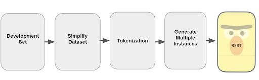
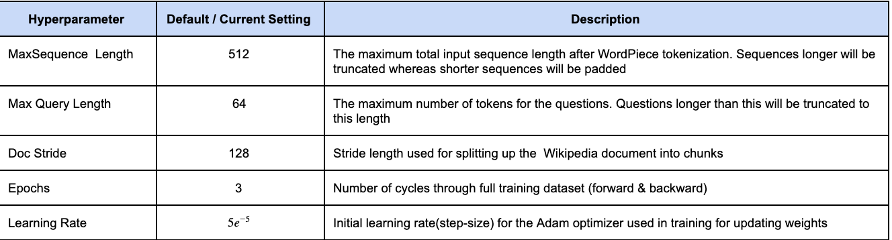
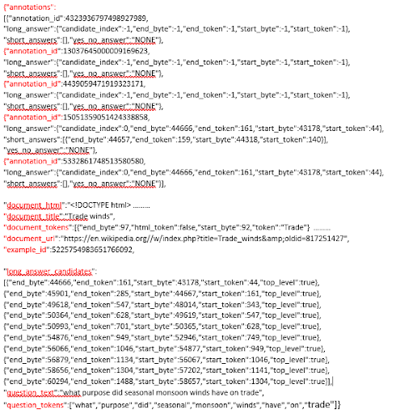
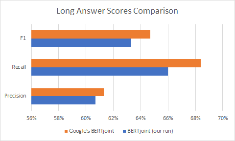
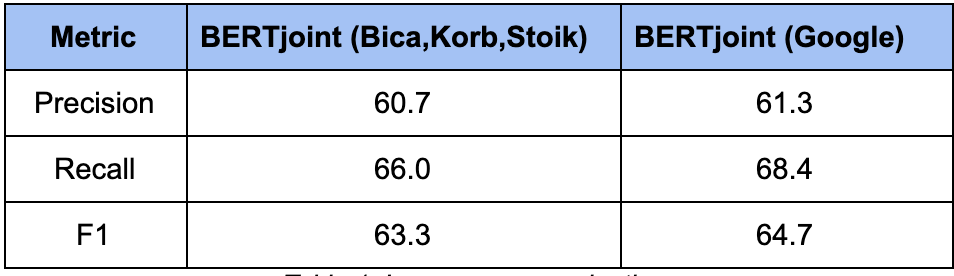

# Google Natural Questions: Question-Answering System
### John Bica | Geoff Korb | Hannah Stoik

## Summary

Summary
An open-domain question answering (QA) system takes natural language questions, such as “Who is the lead singer of Vampire Weekend?”, rather than a set of keywords, such as “Vampire Weekend lead singer”. The returned answer is in the form of short texts, such as “Ezra Koenig”, rather than as a list of relevant documents, like a classic web browser provides. Improved question answering systems will make the search for answers faster and more accurate, which can have a multitude of benefits, from the student who can find information more quickly, to the inexperienced user who can find information at all. To help spur research advances in QA, Google built Natural Questions (NQ) [1], a new, large-scale corpus for training and evaluating open-domain question answering systems, and the first to replicate the end-to-end process in which people find answers to questions. The primary aim of our project is to build and continuously improve on the baseline model and submit it for evaluation.

### Dataset Overview
The NQ corpus uses naturally occurring queries and focuses on finding answers by reading an entire page, rather than extracting answers from a short paragraph. It consists of real, anonymized, aggregated queries that users have posed to Google's search engine. Expert annotators were asked to find answers by reading through an entire Wikipedia page to look for both long answers that cover all of the information required to infer the answer and short answers that answer the question succinctly with the names of one or more entities. The answer could also be null if it deemed that no suitable answer exists on the page. 

The public release consists of 307,373 training examples with single annotations, 7,830 examples with 5-way annotations for development data, and a further 7,842 examples 5-way annotated sequestered as test data. In other words, each training example has a single annotation, from a single annotator whereas examples in the development and test sets have five annotations, from five different annotators. The key reasons for using 5-way annotation is that Google’s research [1] shows that five annotations is likely to be much more robust and also small enough that the cost of annotating each example five times is not prohibitive. Given that an answer can exist in multiple places on a Wikipedia page and is subjective (to an extent) based on expert judgement, 5-way annotation helps account for this and produce better correctness in terms of precision and recall. An example of a five-way annotated sample is included in Appendix C.

### Approach Overview
In Phase One, the primary goal was to reproduce and run the BERT pre-trained baseline model (referred to as BERTjoint to emphasize the fact that it models short and long answers in a single model rather than in a pipeline of two models). BERTjoint was initialized from a BERT (Bidirectional Encoder Representations from Transformers) model already fine-tuned on the Stanford Question Answering Dataset (SQuAD 1.1). It was then trained and optimized using the Natural Question Dataset by minimizing a defined loss function with the Adam optimizer [4]. 

Initial progress of the project included preprocessing a subsample of the development set data, which includes simplifying the data to keep only needed input for model, tokenizing it, and generating multiple instances of each example to feed into the BERTjoint model (this pre-processing flow is shown in Figure 1 below). Inference was drawn and predictions were computed by running the pre-processed data on the model in Google Colabatory.

*Figure 1. Pre-processing of Development Set.*

Going forward, inference will be drawn on the full development set in Google Cloud Platform (GCP) to allow us to compare our prediction scores more accurately and take advantage of GPU access which was a challenge to get working during Phase One. Once working on GCP,  the model will be packaged up in a Docker container and submitted to the Google Challenge for official scores on testing data. Those scores will be assessed and we will begin to train our model on the Google NQ Dataset as well as begin fine-tuning the model through hyperparameter optimization and other sampling techniques described further below in our proposed plan of research.

## Proposed Plan of Research
### Stage Two
We plan to build a model that exceeds the performance of the BERTjoint model and demonstrate that by submitting the newly improved model to the Google Natural Questions competition. 

As mentioned in the Summary, there are several areas of possible improvement we plan to explore. TF-IDF (term frequency - inverse document frequency) is an information retrieval scoring measure that helps determine how relevant a term is in a given document; it could improve model performance by paring down our long answer candidates, making training more effective. Re-configuring the sampling approach is another potential avenue to improvement, because it could address the data imbalance in the development set, and put it in line with the training set at 50/50 long and short answers. For instance, we can look to increase the null answers to long answers ratio in development dataset or to improve the quality of the samples in training using a stricter negative-sampling strategy. A negative sampling strategy can allow for a better and more robust model that better predicts answers and avoids overfitting to a training set that by default does a very good job of learning basic patterns and predicting the negative candidates too easily. Furthermore, BERT requires a specified maximum sequence length, meaning some texts might be too long to fit into one single training instance, and this is a hyperparameter we could tune.

*Table 1. Hyperparameter Descriptions.*

Another area of growing understanding and necessity is Docker, because submission to the competition requires creation of a Docker image. Docker offers encapsulation, isolation, portability, and control over an application and its dependencies. Also, Docker containers are small (megabytes) and they can be easily shared via the public Docker Hub or another public/private repository. Docker will be a valuable tool to learn. Finally, we hope to build a simple web-app or user interface, allowing a user to post a query and select a Wikipedia page and receive the best long and short answer provided by the model we develop.

## Preliminary Results
Initial results from the BERTjoint model run run on Google Colab using a subsample dev-dataset are shown in Appendix D for both long/short answers.The results demonstrate similar metrics to the Google model on long answer prediction, and it slightly outperformed the Google model on short answer prediction. Reasons for the better performance include using a smaller sample of the development data as well as using a max length of tokens set to 512, which is the standard and best practice recommended for BERT models (initial baseline model was set at 384, refer to Appendix B).  Currently, the predictions on the full dev-dataset are being run on GCP to assess the scores and hopefully obtain similar or better results (duration for evaluation is roughly 5 hours). 

## References
[1] Kwiatkowski, T., Palomaki, J., Redfield, O., Collins, M., Parikh, A., Alberti, C., ... & Toutanova, K. (2019). Natural questions: a benchmark for question answering research. Transactions of the Association for Computational Linguistics, 7, 453-466.

[2] Chen, D., Fisch, A., Weston, J., & Bordes, A. (2017). Reading wikipedia to answer open-domain questions. arXiv preprint arXiv:1704.00051.

[3] Chen, Y., & Sha, R. (2019). Question Answering on Natural Questions. Stanford University.

[4] Alberti, C., Lee, K., & Collins, M. (2019). A BERT baseline for the natural questions. arXiv preprint arXiv:1901.08634.

[5] Devlin, Jacob. BERT: Pre-training of Deep Bidirectional Transformers for Language Understanding. Stanford University NLP Seminar, Winter 2019. (2019).

[6] Devlin, J., Chang, M. W., Lee, K., & Toutanova, K. (2018). Bert: Pre-training of deep bidirectional transformers for language understanding. arXiv preprint arXiv:1810.04805.

[7] Wolf, T., Debut, L., Sanh, V., Chaumond, J., Delangue, C., Moi, A., ... & Brew, J. (2019). Huggingface’s transformers: State-of-the-art natural language processing. ArXiv, abs/1910.03771.

[8] Clark, K., Khandelwal, U., Levy, O., & Manning, C. D. (2019). What Does BERT Look At? An Analysis of BERT's Attention. arXiv preprint arXiv:1906.04341.

## Appendix
A. Natural Questions Github repository
https://github.com/google-research-datasets/natural-questions

B. BERT Baseline for NQ Repository
https://github.com/google-research/language/tree/master/language/question_answering/bert_joint

C. Sample of 5-Way Annotated Development Data

D. Results for Bertjoint Pre-trained Model

*Table 1. Long answer evaluation.*

   

*Table 2. Distribution of long answers in HTML.*

